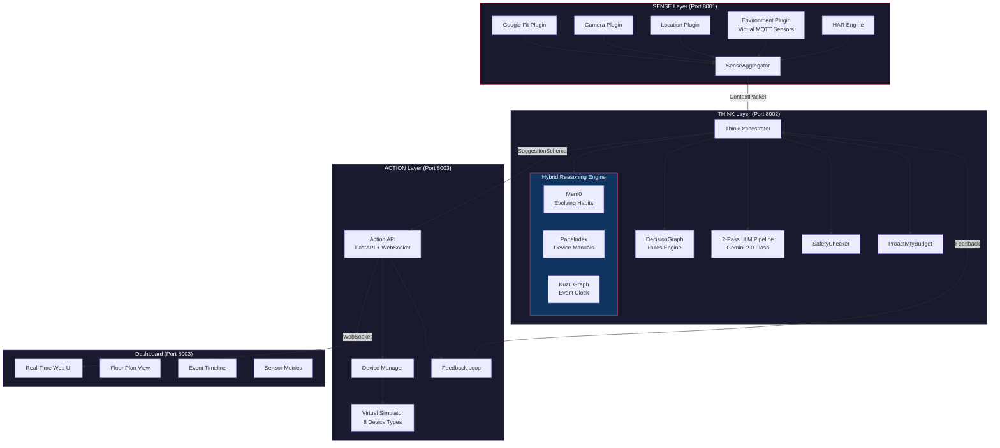

# SADAF — Proactive AIoT Home Assistant
## Complete Implementation Blueprint

> **Serverless-First · Zero External Servers · Local-Only · pip install + python run.py**

---

## Table of Contents

1. [System Architecture](#1-system-architecture)
2. [Project Structure](#2-project-structure)
3. [Milestone 1 — Working E2E Pipeline + Dashboard](#3-milestone-1)
4. [Milestone 2 — Hybrid Reasoning Engine](#4-milestone-2)
5. [Milestone 3 — Device-Agnostic Intelligence](#5-milestone-3)
6. [Milestone 4 — Multi-Agent + Virtual Sensors](#6-milestone-4)
7. [Milestone 5 — Production Security](#7-milestone-5)
8. [Virtual Hardware Simulator](#8-virtual-hardware-simulator)
9. [Dashboard UI](#9-dashboard-ui)
10. [Verification Plan](#10-verification-plan)

---

## 1. System Architecture



---

## 2. Project Structure

The final directory tree after all milestones. Files marked `[EXISTS]` are already implemented; all others are `[NEW]`.

```
AIOT_device/
├── run.py                          [MODIFY] — Main entrypoint, starts all services
├── config.py                       [MODIFY] — Add Mem0, Kuzu, PageIndex, SQLite configs
├── requirements.txt                [MODIFY] — Replace chromadb, update langchain versions
├── devices.json                    [EXISTS] — 8 device definitions
├── plan.txt                        [EXISTS] — High-level architecture plan
├── plan.md                         [NEW]    — THIS FILE — execution blueprint
│
├── common/
│   ├── schemas.py                  [MODIFY] — Add VirtualSensorReading, EventLog, etc.
│   ├── database.py                 [NEW]    — SQLite manager (device state, events, prefs)
│   └── constants.py                [NEW]    — Shared enums (rooms, activities, device types)
│
├── SENSE_module/
│   ├── sense_api.py                [MODIFY] — Add /sensors/inject endpoint for simulator
│   ├── sense_aggregator.py         [MODIFY] — Add env + HAR plugin support
│   ├── plugins/
│   │   ├── base_plugin.py          [EXISTS]
│   │   ├── fit_plugin.py           [EXISTS]
│   │   ├── camera_plugin.py        [EXISTS]
│   │   ├── location_plugin.py      [EXISTS]
│   │   ├── environment_plugin.py   [NEW]    — Virtual env sensors (temp, humidity, etc.)
│   │   └── har_plugin.py           [NEW]    — Activity classifier (rule-based → ML later)
│   └── simulator/
│       ├── virtual_home.py         [NEW]    — Physics simulation of a home environment
│       ├── virtual_sensors.py      [NEW]    — Generates realistic sensor readings
│       ├── scenarios.py            [NEW]    — Pre-built scenarios (morning, sleep, cooking)
│       └── noise.py                [NEW]    — Gaussian noise + drift for realism
│
├── THINK_module/
│   ├── think_orchestrator.py       [MODIFY] — Swap ChromaDB → Mem0, add PageIndex + Graph
│   ├── think_service.py            [MODIFY] — Expose graph query + memory endpoints
│   ├── memory.py                   [MODIFY] — Replace ChromaStore with Mem0Adapter
│   ├── mem0_adapter.py             [NEW]    — Wraps Mem0 with same interface as old ChromaStore
│   ├── pageindex_engine.py         [NEW]    — PageIndex wrapper for doc queries
│   ├── graph_engine.py             [NEW]    — Kuzu wrapper for event clock
│   └── task_decomposer.py          [NEW]    — IoTGPT Decompose-Derive-Refine pipeline
│
├── ACTION_module/
│   ├── __init__.py                 [NEW]
│   ├── action_api.py               [NEW]    — FastAPI endpoints + WebSocket
│   ├── device_manager.py           [NEW]    — Virtual device state machine
│   ├── feedback_engine.py          [NEW]    — Outcome verification + learning
│   └── static/
│       ├── index.html              [NEW]    — Dashboard SPA
│       ├── styles.css              [NEW]    — Dashboard styling
│       ├── app.js                  [NEW]    — Dashboard logic + WebSocket client
│       └── components/
│           ├── floor_plan.js       [NEW]    — SVG-based interactive floor plan
│           ├── device_cards.js     [NEW]    — Live device state cards
│           ├── timeline.js         [NEW]    — Event timeline with causal links
│           ├── sensor_charts.js    [NEW]    — Real-time sensor line charts
│           └── suggestion_panel.js [NEW]    — AI suggestion feed + approve/reject
│
├── docs/                           [NEW]    — For PageIndex to index
│   ├── device_manuals/             [NEW]    — Virtual device technical manuals (PDFs/text)
│   └── safety_rules/               [NEW]    — Safety rulebook documents
│
└── tests/
    ├── test_sense.py               [NEW]    — SENSE layer unit tests
    ├── test_think.py               [NEW]    — THINK layer unit tests
    ├── test_action.py              [NEW]    — ACTION layer unit tests
    ├── test_simulator.py           [NEW]    — Virtual home physics tests
    └── test_e2e.py                 [NEW]    — End-to-end pipeline integration test
```

---

## 3. Milestone 1 — Working E2E Pipeline + Dashboard {#3-milestone-1}

> **Goal:** Complete the empty ACTION_module, wire SENSE → THINK → ACTION into a functional loop, build a real-time dashboard, and create the virtual hardware simulator.

### 3.1 Virtual Hardware Simulator

Since real ESP32/UWB hardware isn't available, we build a **physics-based virtual home** that behaves like a real environment.

#### [NEW] `SENSE_module/simulator/virtual_home.py`

A state machine representing a home with rooms, each having physical properties that change over time based on physics and active devices.

```python
# Core data model
class Room:
    name: str                        # "bedroom", "kitchen", "living_room"
    temperature: float               # °C — drifts toward outdoor temp
    humidity: float                   # % — affected by humidifier, cooking
    brightness: float                # lumens — affected by lights, time of day
    co2: float                       # ppm — rises with occupancy
    noise_db: float                  # dB — affected by fan, AC, TV
    occupants: list[str]             # ["hamza", "mom"]
    active_devices: dict[str, dict]  # device_id → current params

class VirtualHome:
    rooms: dict[str, Room]
    outdoor_temp: float              # Follows a sinusoidal day cycle
    time_of_day: datetime            # Simulated clock (can run faster)

    def tick(self, dt_seconds: float):
        """Advance physics simulation by dt seconds."""
        # 1. Outdoor temp follows sine wave (peak at 14:00, low at 04:00)
        # 2. Each room drifts toward outdoor temp (thermal conductivity)
        # 3. AC/heater actively modifies room temp toward setpoint
        # 4. Fan reduces perceived temp, increases noise
        # 5. Lights set brightness, humidifier sets humidity
        # 6. CO₂ rises with occupants, ventilates slowly
        # 7. Apply Gaussian noise to all readings (realism)
```

#### [NEW] `SENSE_module/simulator/virtual_sensors.py`

Reads from `VirtualHome` and produces sensor data matching real ESP32 output format.

```python
class VirtualSensorArray:
    def __init__(self, home: VirtualHome):
        self.home = home

    def read_room(self, room_name: str) -> dict:
        """Returns sensor readings matching real MQTT payload format."""
        room = self.home.rooms[room_name]
        return {
            "temperature": room.temperature + gaussian_noise(0.3),
            "humidity": room.humidity + gaussian_noise(1.0),
            "brightness_lux": room.brightness + gaussian_noise(5),
            "co2_ppm": room.co2 + gaussian_noise(10),
            "noise_db": room.noise_db + gaussian_noise(2),
            "pir_motion": len(room.occupants) > 0,
            "door_contact": random_bool_with_bias(0.95),  # usually closed
            "power_watts": sum_device_power(room.active_devices),
        }
```

#### [NEW] `SENSE_module/simulator/scenarios.py`

Pre-built scenario scripts that automate user behavior for testing.

```python
SCENARIOS = {
    "morning_routine": [
        (0,   {"move": "hamza", "to": "bathroom"}),
        (300, {"move": "hamza", "to": "kitchen"}),
        (600, {"activity": "cooking"}),
        (1200,{"move": "hamza", "to": "living_room"}),
        (1200,{"activity": "working"}),
    ],
    "sleep_time": [
        (0,   {"move": "hamza", "to": "bedroom"}),
        (60,  {"activity": "relaxing"}),
        (600, {"activity": "sleeping"}),
    ],
    "hot_afternoon": [
        (0,   {"set_outdoor_temp": 42.0}),
        (0,   {"move": "hamza", "to": "bedroom"}),
        (0,   {"activity": "working"}),
    ],
    "emergency_smoke": [
        (0,   {"inject_sensor": {"smoke": True, "co2_ppm": 2000}}),
    ],
}
```

#### [NEW] `SENSE_module/plugins/environment_plugin.py`

Reads from the virtual simulator (dev) or real MQTT broker (production).

```python
class EnvironmentPlugin(BasePlugin):
    async def sense(self) -> Dict[str, Any]:
        if USE_VIRTUAL_SENSORS:
            readings = virtual_sensors.read_room(current_room)
        else:
            readings = await mqtt_client.get_latest()
        return {"environment": readings}
```

---

### 3.2 ACTION Module

#### [NEW] `ACTION_module/device_manager.py`

Virtual device state machine — each device is a finite state machine whose state changes propagate back to the VirtualHome physics.

```python
class VirtualDevice:
    id: str
    device_type: str                 # from devices.json
    is_on: bool
    params: dict                     # current parameter values
    capabilities: dict               # from devices.json

    def execute(self, command: str, params: dict) -> dict:
        """Execute a command, update state, return result."""
        # Validate command against capabilities
        # Update internal state
        # Propagate effect to VirtualHome (e.g., AC set to 22°C
        #   → VirtualHome bedroom target_temp = 22)
        # Return {success: True, new_state: {...}}

class DeviceManager:
    devices: dict[str, VirtualDevice]  # loaded from devices.json
    db: SQLiteDB                       # persists state across restarts

    def execute_action(self, action: ActionCommand) -> dict:
        """Execute an ActionCommand from SuggestionSchema."""
    def get_all_states(self) -> list[DeviceState]:
        """Return current state of all devices."""
    def get_device(self, device_id: str) -> VirtualDevice:
        """Get a specific device."""
```

#### [NEW] `ACTION_module/action_api.py`

```python
# FastAPI app on port 8003
app = FastAPI(title="SADAF Action Layer")

@app.post("/execute")
async def execute_suggestion(suggestion: SuggestionSchema):
    """Execute a suggestion from THINK module."""
    # 1. Safety check (redundant, defense in depth)
    # 2. Execute via DeviceManager
    # 3. Log event to SQLite
    # 4. Push state update via WebSocket
    # 5. Schedule outcome verification (feedback loop)

@app.get("/state")
async def get_state():
    """Return all device states + room environments."""

@app.post("/override")
async def user_override(device_id: str, command: str, params: dict):
    """Manual user control → stores as negative feedback."""

@app.websocket("/ws")
async def websocket_endpoint(ws: WebSocket):
    """Push real-time updates: device changes, suggestions, sensor data."""

# Also serves static/ directory for dashboard
app.mount("/", StaticFiles(directory="static", html=True))
```

#### [NEW] `ACTION_module/feedback_engine.py`

```python
class FeedbackEngine:
    def schedule_verification(self, action: ActionCommand, expected: dict):
        """After action, wait N seconds, then check sensors."""
        # e.g., AC set to 22°C → after 300s, check if room temp < 24°C

    def process_override(self, device_id: str, user_action: dict, ai_suggestion: dict):
        """User manually changed something the AI set → negative feedback."""
        # 1. Store in Mem0 (update preference)
        # 2. Store in Graph (override event with causal chain)
        # 3. Log in SQLite
```

---

### 3.3 SQLite State Database

#### [NEW] `common/database.py`

```python
class SadafDB:
    """Embedded SQLite database for all persistent state."""

    def __init__(self, path: str = "./sadaf.db"):
        self.conn = sqlite3.connect(path, check_same_thread=False)
        self._create_tables()

    # Tables:
    # device_states — current state of each device (survives restart)
    # event_log — every action taken, with timestamp + context
    # sensor_history — rolling window of sensor readings (for charts)
    # preferences — structured user prefs (backup to Mem0)
    # suggestion_history — all suggestions + accept/reject status
```

---

### 3.4 Main Entry Point

#### [MODIFY] `run.py`

```python
"""Start all three SADAF services + virtual simulator."""
import uvicorn
import asyncio
from multiprocessing import Process

def start_sense():
    uvicorn.run("SENSE_module.sense_api:app", host="0.0.0.0", port=8001)

def start_think():
    uvicorn.run("THINK_module.think_service:app", host="0.0.0.0", port=8002)

def start_action():
    uvicorn.run("ACTION_module.action_api:app", host="0.0.0.0", port=8003)

if __name__ == "__main__":
    # Start virtual home simulator in background
    # Start all 3 services
    # Print dashboard URL: http://localhost:8003
    processes = [
        Process(target=start_sense),
        Process(target=start_think),
        Process(target=start_action),
    ]
    for p in processes:
        p.start()
    print("\n🏠 SADAF Dashboard: http://localhost:8003\n")
    for p in processes:
        p.join()
```

---

### 3.5 Updated Dependencies

#### [MODIFY] `requirements.txt`

```diff
 # API Framework
 fastapi==0.115.5
 uvicorn[standard]==0.32.0
+websockets>=12.0

 # HTTP Client
 httpx>=0.25.1
 requests>=2.31.0

 # Data Validation
 pydantic>=2.4.2
 python-dateutil==2.9.0.post0

-# Vector Database
-chromadb>=0.4.15
+# Hybrid Reasoning Engine
+mem0ai>=0.1.0
+pageindex>=0.1.0
+kuzu>=0.4.0

 # Google Services
 google-api-python-client==2.151.0
 google-auth==2.35.0
 google-auth-oauthlib==1.2.1
 google-generativeai>=0.2.0
 googlemaps>=4.10.0

 # LangChain Packages
-langchain==0.0.325
-langchain-core==0.0.8
-langchain-community==0.0.8
-langchain-google-genai==0.0.3
+langchain>=0.3.0
+langchain-core>=0.3.0
+langchain-community>=0.3.0
+langchain-google-genai>=2.0.0
+langgraph>=0.2.0

 # Environment Variables
 python-dotenv>=1.0.0
+
+# Testing
+pytest>=8.0.0
+pytest-asyncio>=0.24.0
```

---

## 4. Milestone 2 — Hybrid Reasoning Engine {#4-milestone-2}

> **Goal:** Replace ChromaDB with Mem0 + PageIndex + Kuzu, implement IoTGPT task decomposition, and wire the feedback loop.

### 4.1 Mem0 Adapter

#### [NEW] `THINK_module/mem0_adapter.py`

Wraps Mem0 with the same interface the existing `ThinkOrchestrator` expects, making the swap seamless.

```python
from mem0 import Memory, MemoryConfig

class Mem0Adapter:
    """Drop-in replacement for ChromaStore using Mem0."""

    def __init__(self):
        config = {
            "llm": {"provider": "ollama", "config": {"model": "llama3"}},
            "embedder": {"provider": "ollama",
                         "config": {"model": "nomic-embed-text"}},
            "vector_store": {"provider": "lancedb",
                             "config": {"path": "./mem0_data"}}
        }
        self.memory = Memory.from_config(MemoryConfig(**config))

    def add_document(self, text: str, metadata: dict = None, user_id: str = "default"):
        """Store a memory. Mem0 auto-deduplicates and evolves."""
        return self.memory.add(text, user_id=user_id, metadata=metadata)

    def get_relevant_info(self, query: str, user_id: str = "default", n: int = 5):
        """Retrieve relevant memories as a formatted string."""
        results = self.memory.search(query, user_id=user_id, limit=n)
        if not results:
            return "No relevant memories found."
        return "\n".join(f"- {r['memory']}" for r in results)

    def update_from_override(self, old_pref: str, new_pref: str, user_id: str):
        """When user overrides AI, update the evolving preference."""
        self.memory.add(
            f"User changed preference: was '{old_pref}', now prefers '{new_pref}'",
            user_id=user_id
        )
```

---

### 4.2 PageIndex Engine

#### [NEW] `THINK_module/pageindex_engine.py`

```python
from pageindex import PageIndex

class PageIndexEngine:
    """Structured document retrieval for device manuals and safety rules."""

    def __init__(self, docs_dir: str = "./docs"):
        self.index = PageIndex()
        self._load_documents(docs_dir)

    def _load_documents(self, docs_dir: str):
        """Index all PDFs in the docs directory."""
        for pdf_path in Path(docs_dir).rglob("*.pdf"):
            self.index.add_document(str(pdf_path))
        # Also index text files for virtual device manuals
        for txt_path in Path(docs_dir).rglob("*.txt"):
            self.index.add_document(str(txt_path))

    def query(self, question: str) -> dict:
        """Query with LLM-navigated tree search. Returns answer + source."""
        result = self.index.query(question)
        return {
            "answer": result.answer,
            "source": result.source,       # page/section reference
            "confidence": result.confidence
        }

    def safety_check(self, action_description: str) -> dict:
        """Ask PageIndex if an action is safe per device manuals."""
        return self.query(f"Is it safe to {action_description}? "
                         f"What are the safety limits?")

    def device_spec(self, device_id: str, spec_question: str) -> dict:
        """Look up exact device specs from manufacturer manual."""
        return self.query(f"For device {device_id}: {spec_question}")
```

#### [NEW] `docs/device_manuals/*.txt`

Create virtual device manuals for each device in `devices.json`:

```
# smart_geyser_1 — Technical Manual

## Safety Specifications
- Maximum safe temperature: 60°C
- Minimum operating temperature: 30°C
- Auto-shutoff: Activates if temperature exceeds 65°C
- NEVER operate when home is unoccupied
- Required maintenance: Descale annually

## Operating Parameters
- Temperature range: 30°C - 75°C (recommended max: 60°C)
- Power consumption: 2000W at full heating
- Heating rate: ~5°C per minute
- Standby power: 5W
```

(One manual per device type: light, fan, AC, heater, plug, geyser, humidifier, induction)

---

### 4.3 Graph Engine (Kuzu)

#### [NEW] `THINK_module/graph_engine.py`

```python
import kuzu

class EventGraphEngine:
    """Embedded graph DB for causal reasoning (Event Clock)."""

    def __init__(self, db_path: str = "./kuzu_data"):
        self.db = kuzu.Database(db_path)
        self.conn = kuzu.Connection(self.db)
        self._create_schema()

    def _create_schema(self):
        """Create node and relationship tables."""
        # Nodes
        self.conn.execute("CREATE NODE TABLE IF NOT EXISTS User(id STRING, name STRING, PRIMARY KEY(id))")
        self.conn.execute("CREATE NODE TABLE IF NOT EXISTS Device(id STRING, type STRING, room STRING, PRIMARY KEY(id))")
        self.conn.execute("CREATE NODE TABLE IF NOT EXISTS Action(id STRING, command STRING, params STRING, ts TIMESTAMP, PRIMARY KEY(id))")
        self.conn.execute("CREATE NODE TABLE IF NOT EXISTS SensorEvent(id STRING, type STRING, value DOUBLE, room STRING, ts TIMESTAMP, PRIMARY KEY(id))")
        self.conn.execute("CREATE NODE TABLE IF NOT EXISTS Policy(id STRING, name STRING, rule STRING, PRIMARY KEY(id))")
        # Relationships
        self.conn.execute("CREATE REL TABLE IF NOT EXISTS TRIGGERED_BY(FROM Action TO SensorEvent)")
        self.conn.execute("CREATE REL TABLE IF NOT EXISTS APPLIED_POLICY(FROM Action TO Policy)")
        self.conn.execute("CREATE REL TABLE IF NOT EXISTS ACTED_ON(FROM Action TO Device)")
        self.conn.execute("CREATE REL TABLE IF NOT EXISTS REQUESTED_BY(FROM Action TO User)")
        self.conn.execute("CREATE REL TABLE IF NOT EXISTS OVERRIDDEN_BY(FROM Action TO Action)")

    def log_action(self, action_id: str, user_id: str, device_id: str,
                   command: str, params: dict, policy: str,
                   trigger_sensor: str = None):
        """Record an action with its full causal chain."""
        # Insert Action node
        # Create ACTED_ON edge to Device
        # Create REQUESTED_BY edge to User
        # Create APPLIED_POLICY edge to Policy
        # If trigger_sensor, create TRIGGERED_BY edge

    def query_why(self, action_id: str) -> list[dict]:
        """'Why did this action happen?' → traverse causal chain."""
        return self.conn.execute(
            "MATCH (a:Action {id: $id})-[r]->(n) RETURN type(r), n",
            {"id": action_id}
        ).get_as_df().to_dict("records")

    def query_overrides(self, user_id: str, device_type: str = None) -> list[dict]:
        """'Show all times user overrode AI for device type X'."""
        query = """
            MATCH (u:User {id: $uid})<-[:REQUESTED_BY]-(override:Action)
                  -[:OVERRIDDEN_BY]->(original:Action)-[:ACTED_ON]->(d:Device)
            RETURN override, original, d.type, override.ts
            ORDER BY override.ts DESC LIMIT 20
        """
        return self.conn.execute(query, {"uid": user_id}).get_as_df().to_dict("records")

    def get_pattern(self, time_range: str, room: str) -> list[dict]:
        """Find patterns: 'What usually happens at this time in this room?'"""
        # Cypher query for recurring actions in time window
```

---

### 4.4 IoTGPT Task Decomposer

#### [NEW] `THINK_module/task_decomposer.py`

```python
class TaskDecomposer:
    """IoTGPT-style Decompose → Derive → Refine pipeline."""

    def __init__(self, llm, mem0: Mem0Adapter, pageindex: PageIndexEngine,
                 device_capabilities: dict):
        self.llm = llm
        self.mem0 = mem0
        self.pageindex = pageindex
        self.capabilities = device_capabilities

    async def decompose(self, instruction: str) -> list[str]:
        """Stage 1: Break high-level command into subtasks."""
        # LLM prompt: "Break this into atomic IoT subtasks: {instruction}"
        # Returns: ["dim bedroom lights", "set AC to cool", "close blinds"]

    async def derive(self, subtasks: list[str]) -> list[dict]:
        """Stage 2: Map subtasks to device API commands."""
        # For each subtask:
        #   1. Find matching device from capabilities
        #   2. Query PageIndex for exact parameter specs
        #   3. Generate ActionCommand template
        # Returns: [{"device_id": "smart_light_1", "command": "set_brightness", "params": {}}]

    async def refine(self, commands: list[dict], user_id: str) -> list[ActionCommand]:
        """Stage 3: Inject user preferences into command parameters."""
        # For each command:
        #   1. Query Mem0 for user's preferred values
        #   2. Validate against PageIndex safety specs
        #   3. Fill in concrete parameter values
        # Returns: [ActionCommand(device_id="smart_light_1", command="set_brightness", params={"brightness": 10})]

    async def execute_pipeline(self, instruction: str, user_id: str) -> list[ActionCommand]:
        """Full Decompose → Derive → Refine pipeline."""
        subtasks = await self.decompose(instruction)
        commands = await self.derive(subtasks)
        return await self.refine(commands, user_id)
```

---

### 4.5 ThinkOrchestrator Modifications

#### [MODIFY] `THINK_module/think_orchestrator.py`

Key changes:
1. Replace `ChromaStore` with `Mem0Adapter`
2. Add `PageIndexEngine` and `EventGraphEngine` to constructor
3. Modify `process_context()` to use Hybrid Search pattern:
   - Step 1: `mem0.get_relevant_info(query)` → user preferences
   - Step 2: `pageindex.query(device_question)` → device specs
   - Step 3: `graph.get_pattern(time, room)` → historical patterns
   - Step 4: All three fed into Pass 1 LLM prompt
4. After action execution, call `graph.log_action()` to record causal chain

---

## 5. Milestone 3 — Device-Agnostic Intelligence {#5-milestone-3}

> **Goal:** Environmental property abstraction, EUPont ontology, adaptive personalization.

### 5.1 Environmental Properties Schema

#### [MODIFY] `common/schemas.py`

```python
class EnvironmentalPreference(BaseModel):
    """Device-agnostic preference — describes desired physical state."""
    temperature_celsius: Optional[tuple[float, float]] = None  # (min, max)
    humidity_percent: Optional[tuple[float, float]] = None
    brightness_lumens: Optional[tuple[float, float]] = None
    noise_level_db: Optional[float] = None                     # max acceptable
    air_quality_min: Optional[str] = None                      # "good", "moderate"

class UserProfile(BaseModel):
    user_id: str
    name: str
    preferences: dict[str, EnvironmentalPreference]  # activity → preference
    # e.g., {"sleeping": EnvironmentalPreference(temp=(22,24), brightness=(0,0))}
```

### 5.2 EUPont Ontology Mapper

#### [NEW] `THINK_module/ontology_mapper.py`

Maps devices to environmental properties they can affect:

```python
# Ontology: which devices affect which environmental properties
DEVICE_PROPERTY_MAP = {
    "smart_ac_1":        {"temperature": "decrease", "noise": "increase", "humidity": "decrease"},
    "smart_heater_1":    {"temperature": "increase"},
    "smart_fan_1":       {"temperature": "decrease_perceived", "noise": "increase"},
    "smart_light_1":     {"brightness": "set"},
    "smart_humidifier_1":{"humidity": "increase"},
    # ...
}

class OntologyMapper:
    def find_devices_for_property(self, property: str, direction: str) -> list[str]:
        """Which devices can increase/decrease temperature?"""

    def resolve_preference(self, preference: EnvironmentalPreference,
                          available_devices: list[str]) -> list[ActionCommand]:
        """Convert a preference into device commands using available hardware."""
```

### 5.3 Adaptive Personalization

#### [NEW] `THINK_module/personalization.py`

```python
class PersonalizationEngine:
    def __init__(self, mem0: Mem0Adapter, graph: EventGraphEngine):
        self.mem0 = mem0
        self.graph = graph

    def learn_from_override(self, user_id: str, context: ContextPacket,
                           ai_action: ActionCommand, user_action: dict):
        """Q-learning style: negative reward for overridden actions."""
        # 1. Record override in graph
        # 2. Update Mem0 preference
        # 3. Adjust confidence weights

    def resolve_conflict(self, user_preferences: dict[str, EnvironmentalPreference]) -> EnvironmentalPreference:
        """Multi-occupant: weighted merge of conflicting preferences."""
        # Priority rules: health > comfort > energy saving
```

---

## 6. Milestone 4 — Multi-Agent + Virtual Sensors {#6-milestone-4}

> **Goal:** LangGraph multi-agent orchestration, HAR model, vision pipeline.

### 6.1 LangGraph Multi-Agent

#### [NEW] `THINK_module/agents/`

```
agents/
├── __init__.py
├── comfort_agent.py      — Temperature, lighting, humidity optimization
├── security_agent.py     — Lock verification, anomaly detection
├── energy_agent.py       — Power monitoring, eco-mode suggestions
├── wellness_agent.py     — Activity reminders, health nudges
└── orchestrator_graph.py — LangGraph state machine wiring all agents
```

Each agent is a LangGraph node with access to Mem0, PageIndex, and Graph.

```python
# orchestrator_graph.py
from langgraph.graph import StateGraph

def build_agent_graph():
    graph = StateGraph(AgentState)
    graph.add_node("comfort", comfort_agent)
    graph.add_node("security", security_agent)
    graph.add_node("energy", energy_agent)
    graph.add_node("wellness", wellness_agent)
    graph.add_node("safety_check", safety_checker)
    graph.add_node("human_approval", human_approval_node)

    # Routing: context → relevant agents → safety → (optional) human → execute
    graph.add_conditional_edges("__start__", route_to_agents)
    graph.add_edge("comfort", "safety_check")
    graph.add_edge("security", "safety_check")
    graph.add_conditional_edges("safety_check", needs_human_approval)
    return graph.compile()
```

### 6.2 HAR Plugin (Rule-Based → ML)

#### [NEW] `SENSE_module/plugins/har_plugin.py`

Phase 1: Rule-based classifier using sensor patterns.
Phase 2 (future): trained LightGBM model.

```python
class HARPlugin(BasePlugin):
    async def sense(self) -> Dict[str, Any]:
        """Classify current activity from sensor context."""
        # Rules:
        # - Low light + low motion + nighttime → sleeping
        # - Kitchen motion + high temp + high humidity → cooking
        # - Desk area + moderate light + typing sounds → working
        # - High heart rate + movement → exercising
        return {"har": {"activity": activity, "confidence": conf}}
```

---

## 7. Milestone 5 — Production Security {#7-milestone-5}

> **Goal:** MCP protocol, vault layer, zero-trust authentication, encryption.

### 7.1 MCP Server

#### [NEW] `mcp_server/`

Exposes the home as an MCP-compatible server so any LLM can control it.

### 7.2 Vault Layer

#### [NEW] `security/vault.py`

Lightweight JIT secret injection without HashiCorp (for dev):

```python
class SecretVault:
    """Encrypted secret store with JIT injection and audit logging."""
    def __init__(self, vault_path: str = "./.vault.enc", passphrase: str = None):
        # Encrypted JSON file using Fernet (from cryptography lib)
        pass

    def inject(self, key_name: str) -> str:
        """Decrypt and return a secret. Log access. Auto-scrub after 30s."""

    def scrub(self, key_name: str):
        """Remove secret from memory immediately after use."""
```

---

## 8. Virtual Hardware Simulator {#8-virtual-hardware-simulator}

The simulator replaces all physical hardware with code that mimics real behavior.

| Real Hardware | Virtual Replacement | Behavior |
|---|---|---|
| ESP32 temp sensor | `virtual_home.py` Room.temperature | Follows thermal dynamics: outdoor drift, AC cooling rate, heater warming rate |
| ESP32 humidity sensor | `virtual_home.py` Room.humidity | Affected by humidifier, cooking steam, and natural ventilation |
| PIR motion sensor | `virtual_home.py` Room.occupants | Scenario-driven occupant movement between rooms |
| UWB localization | `scenarios.py` move events | User moves between rooms on schedule |
| Smart Light | `device_manager.py` VirtualDevice | State machine: on/off, brightness 0-100%, color temp 2700-6500K |
| Smart AC | `device_manager.py` VirtualDevice | State machine: mode, setpoint → feeds back to Room.temperature |
| Smart Fan | `device_manager.py` VirtualDevice | Reduces perceived temp, adds noise to Room.noise_db |
| Smart Geyser | `device_manager.py` VirtualDevice | Temperature ramp-up physics, auto-shutoff safety |
| Door contact | `virtual_sensors.py` | Boolean state, scenario-driven |
| Camera | `camera_plugin.py` | Already simulated (emotion, focus) |

**Physics model runs at 1 tick/second (configurable speed multiplier for demo).**

---

## 9. Dashboard UI {#9-dashboard-ui}

A single-page web application served from `ACTION_module/static/` on port 8003.

### Layout

```
┌──────────────────────────────────────────────────────────┐
│  SADAF Dashboard                              🟢 LIVE   │
├──────────────┬───────────────────────────────────────────┤
│              │                                           │
│  FLOOR PLAN  │  SENSOR CHARTS (real-time line graphs)    │
│  (SVG rooms  │  ├── Temperature per room                 │
│   with color │  ├── Humidity per room                    │
│   coding by  │  ├── CO₂ levels                          │
│   temp,      │  └── Power consumption                   │
│   occupant   │                                           │
│   icons,     ├───────────────────────────────────────────┤
│   device     │                                           │
│   states)    │  AI SUGGESTION PANEL                      │
│              │  ├── Current suggestion + reason           │
│              │  ├── [✓ Accept] [✗ Reject] buttons        │
│              │  └── Suggestion history (scrollable)      │
│              │                                           │
├──────────────┼───────────────────────────────────────────┤
│              │                                           │
│  DEVICE      │  EVENT TIMELINE (causal chain view)       │
│  CARDS       │  ├── Chronological action log              │
│  (grid of    │  ├── Each event shows: trigger → policy    │
│   toggleable │  │   → action → outcome                   │
│   device     │  └── Click to expand causal graph         │
│   widgets)   │                                           │
│              │                                           │
└──────────────┴───────────────────────────────────────────┘
```

### Key Features

1. **Floor Plan View** — SVG rendering of rooms, color-coded by temperature (blue=cool, red=hot). Occupant avatars move between rooms. Device icons show on/off state.

2. **Real-Time Sensor Charts** — Line charts (Canvas-based, no library dependency) showing 5-minute rolling window of sensor data per room.

3. **Device Cards** — Interactive cards for each device. Click to toggle on/off, drag sliders for parameters (brightness, temperature). Manual changes trigger the override feedback loop.

4. **AI Suggestion Panel** — Live feed of suggestions from THINK module. Each suggestion shows reasoning text, affected devices, confidence score, and Accept/Reject buttons.

5. **Event Timeline** — Chronological log of all actions (AI and manual). Expandable to show the causal chain from the Kuzu graph: which sensor triggered it, what policy was applied, who requested it.

6. **Scenario Runner** — Dropdown to load pre-built scenarios (morning routine, sleep time, etc.) for quick demo.

### Technology

- **Pure HTML/CSS/JS** — no build step, no npm, no React
- **WebSocket** for real-time data push from Action API
- **Canvas** for sensor charts (lightweight, no chart library)
- **SVG** for floor plan (interactive, animatable)
- **CSS Variables** for theming (dark mode default, glassmorphism accents)

---

## 10. Verification Plan {#10-verification-plan}

### Automated Tests

```bash
# Run all tests
pytest tests/ -v

# Individual test suites
pytest tests/test_simulator.py -v    # VirtualHome physics correctness
pytest tests/test_sense.py -v        # Sensor plugins + aggregation
pytest tests/test_think.py -v        # Orchestrator + Mem0 + PageIndex
pytest tests/test_action.py -v       # Device manager + state persistence
pytest tests/test_e2e.py -v          # Full SENSE→THINK→ACTION pipeline
```

#### Test Coverage

| Test File | What It Tests |
|---|---|
| `test_simulator.py` | VirtualHome temp drift, AC cooling rate, occupant movement, noise model |
| `test_sense.py` | EnvironmentPlugin reads from simulator, HARPlugin classifies activities, ContextPacket assembly |
| `test_think.py` | Mem0Adapter add/search/update, PageIndex device manual queries, Kuzu event logging + causal query, IoTGPT decompose→derive→refine pipeline |
| `test_action.py` | DeviceManager execute + state, SQLite persistence across restart, WebSocket push, FeedbackEngine override processing |
| `test_e2e.py` | Full pipeline: inject scenario → SENSE aggregates → THINK suggests → ACTION executes → sensors verify effect |

### Manual Verification (User)

1. **Start the system**: `python run.py`
2. **Open dashboard**: Navigate to `http://localhost:8003`
3. **Run a scenario**: Select "hot_afternoon" from the scenario dropdown
4. **Observe**: Floor plan should show bedroom in red (hot), AI should suggest turning on AC
5. **Accept suggestion**: Click ✓ → AC turns on → watch temperature line chart decrease over 60s
6. **Test override**: Manually set AC to 26°C (instead of AI's 22°C) → check that the suggestion panel shows "Preference updated"
7. **Test safety**: Try to set geyser to 80°C via device card → should be blocked with safety message referencing the device manual

### Browser-Based Verification

After implementation, we will use the browser tool to:
1. Navigate to `http://localhost:8003`
2. Verify the floor plan renders with correct room layout
3. Verify device cards show all 8 devices from `devices.json`
4. Verify sensor charts update in real-time via WebSocket
5. Verify suggestion panel shows AI suggestions with Accept/Reject
6. Verify event timeline logs actions chronologically

---

> [!IMPORTANT]
> **Execution Order:** Each milestone builds on the previous one. Start with Milestone 1 (E2E pipeline + dashboard) to get a visible, testable system immediately. Then layer on Mem0/PageIndex/Kuzu in Milestone 2 without breaking the working pipeline.
