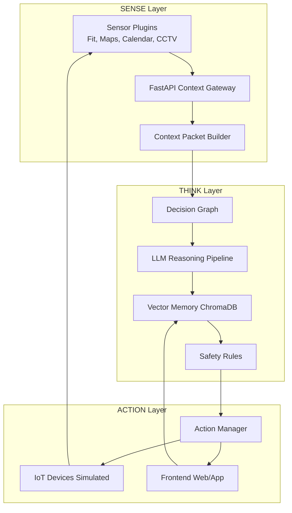

# Sadaf — Proactive AIoT Assistant

ppt link -> https://docs.google.com/presentation/d/1XI0REYW7NCei7vNISOm6jmkpwAEqDLCSjojr-nMHELA/edit?usp=sharing

*A modular, context-aware, human-in-the-loop AI assistant for smart environments.*

Sadaf is a next-generation **Proactive AIoT Assistant** built on a clear **SENSE → THINK → ACTION** pipeline. Instead of waiting for voice commands, Sadaf continuously interprets real-world context, reasons using a multi-stage LLM pipeline, learns from user behavior, and triggers safe, helpful actions on IoT devices.

---

## ✨ Key Capabilities

- **Context-aware proactive suggestions** (based on biometrics, location, environment, schedule)
- **Modular plugin-based SENSE layer** (easily add new sensors)
- **Two-pass LLM reasoning pipeline** (intent → structured action)
- **Adaptive long-term memory with ChromaDB**
- **Hard safety rule layer** to prevent harmful actions
- **Human-in-the-loop actions** for full user control
- **Real-time state updates** via WebSockets/SSE
- **Device Simulator** for easy development without real hardware

---

## 🏗️ High-Level System Architecture

### SENSE → THINK → ACTION



---

## 🔍 Module Breakdown

### 🔸 SENSE Layer

Collects and normalizes sensor data from:

- Google Fit
- Maps (Travel time, location)
- Calendar events
- Occupancy/CCTV
- Mobile state / battery
- Custom user-defined sensors

Produces a unified **Context Packet** with confidence scores.

### 🔸 THINK Layer

This is the "brain":

- **Decision Graph** handles simple deterministic logic
- **Two-Pass LLM Pipeline**
  - **Pass 1:** Analyze context → produce intention + explanation
  - **Pass 2:** Convert intention → strict JSON action schema
- **Vector Memory** learns from user "Yes/No" feedback
- **Safety Rule Layer** blocks harmful or illogical actions

### 🔸 ACTION Layer

Executes validated, safe actions:

- Talks to simulated or real IoT devices
- Ensures parameters match device capability schema
- Streams updates to React frontend
- Logs every decision for debugging

---

## 🚀 Getting Started

### Prerequisites

- **Python 3.11+**
- **pip or Poetry**
- **Google AI Studio API Key (Gemini)**

### Installation

**1. Clone Repository**

```bash
git clone https://github.com/HamzaDevv/Proactive-AIoT-Assistant.git
cd Proactive-AIoT-Assistant
```

**2. Create Virtual Environment**

```bash
python -m venv venv
```

- Windows: `.\venv\Scripts\activate`
- macOS/Linux: `source venv/bin/activate`

**3. Install Dependencies**

```bash
pip install -r requirements.txt
```

**4. Setup Environment Variables**

Create `.env` in your project root:

```env
GOOGLE_API_KEY=YOUR_GEMINI_API_KEY_HERE
```

**5. Run Server**

```bash
uvicorn src.main:app --reload
```

App starts at: **http://127.0.0.1:8000**

API docs available at: **http://127.0.0.1:8000/docs**

---

## 📁 Project Structure

```
Proactive-AIoT-Assistant/
├── README.md
├── .gitignore
├── requirements.txt
├── .env
└── src/
    ├── main.py
    │
    ├── core/
    │   ├── schemas.py
    │   └── logging_config.py
    │
    ├── module_1_sense/
    │   ├── sense_manager.py
    │   └── plugins/
    │       ├── fit.py
    │       ├── maps.py
    │       ├── calendar.py
    │       └── camera.py
    │
    ├── module_2_think/
    │   ├── think_manager.py
    │   ├── decision_graph.py
    │   ├── llm_pipeline.py
    │   ├── memory.py
    │   └── safety.py
    │
    └── module_3_action/
        ├── action_manager.py
        ├── device_simulator.py
        ├── schemas.py
        └── websocket_manager.py
```

---

## 🔧 Configuration Files

### .gitignore

```
venv/
.env
__pycache__/
*.pyc
.DS_Store
.vscode/
.idea/
```

### requirements.txt

```
fastapi
uvicorn[standard]
pydantic
google-generativeai
chromadb
google-api-python-client
google-auth-httplib2
google-auth-oauthlib
```

---

## 📖 Usage

Once the server is running, the system will:

1. Continuously collect context from configured sensors
2. Analyze the context using the LLM reasoning pipeline
3. Generate proactive suggestions based on learned patterns
4. Present actions to the user for approval
5. Execute approved actions on IoT devices
6. Learn from user feedback to improve future suggestions

---

## 🤝 Contributing

Contributions are welcome! Please feel free to submit a Pull Request.

1. Fork the repository
2. Create your feature branch (`git checkout -b feature/AmazingFeature`)
3. Commit your changes (`git commit -m 'Add some AmazingFeature'`)
4. Push to the branch (`git push origin feature/AmazingFeature`)
5. Open a Pull Request

---

## 📄 License

This project is licensed under the **MIT License** - see the LICENSE file for details.

---

## 🙏 Acknowledgments

- Built with FastAPI and Google Generative AI
- Uses ChromaDB for vector memory
- Inspired by the vision of truly intelligent smart homes

---

## 📧 Contact

For questions or support, please open an issue on GitHub.

**Project Link:** [https://github.com/HamzaDevv/Proactive-AIoT-Assistant](https://github.com/HamzaDevv/Proactive-AIoT-Assistant)
